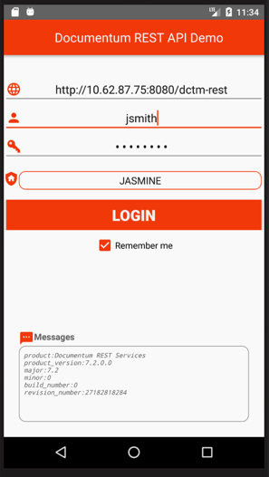
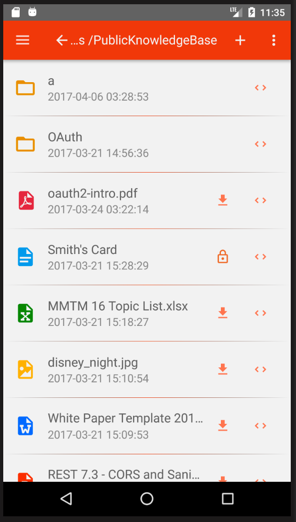
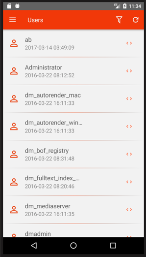
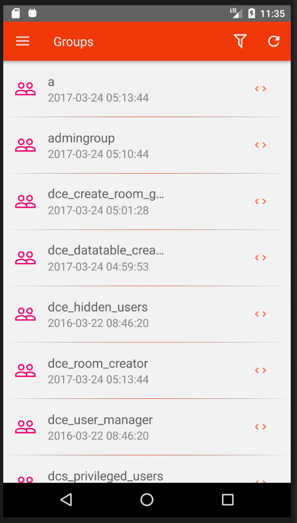
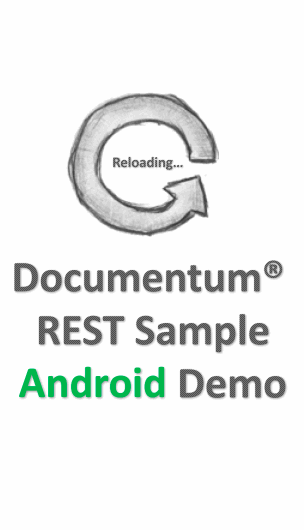
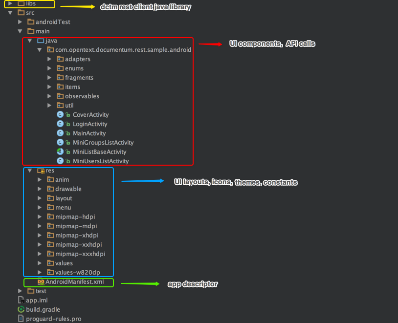

# Documentum REST Services Android Sample

The project demonstrates the development of an Android application to access Documentum repositories. It uses [Documentum REST Java Client](https://github.com/Enterprise-Content-Management/documentum-rest-client-java) to communicate with Documentum REST Services. As a sample, there are several cabinets, folders, documents, users and groups related features implemented in this app.

| Authentication | Object Management | User Management | Group Management |
| ------------------ | ------------------ | ------------------ | ------------------ |
|  |  |   |   |
|<ul><li>Basic login</li><li>Logout</li></ul>|<ul><li>Navigate cabinets, folders, docs</li><li>Create</li><li>Update</li><li>Delete</li><li>Checkout</li><li>Checkin</li><li>Copy</li><li>Move</li><li>Get content</li></ul>|<ul><li>Navigate users</li><li>Create</li><li>Update</li><li>Delete</li><li>Add to groups</li></ul>|<ul><li>Navigate groups</li><li>Create</li><li>Update</li><li>Delete</li><li>Add members</li><li>Remove members</li></ul>|

## 1. Getting started

* Download and install the free [Android Studio](https://developer.android.com/studio/index.html)
* Download this project to your local worksapce
* Import this project as a Gradle project into Android Studio
* Build and run in Android device emulator

## 2. Demo

Below gif demo shows the basic navagiation of this Android app. When you build & run this app by yourself, you will see more features.

  

## 3. Code Structure

Below diagram shows the basic code structure this project.

  

* Manifest
  [Android Manifest](https://developer.android.com/guide/topics/manifest/manifest-intro.html) is Android's config file, including permissions, component registrations and so on.
  
* Activities
  This app is organised by [activities](https://developer.android.com/guide/components/activities/index.html) and [fragments](https://developer.android.com/guide/components/fragments.html). Activities are one of the fundamental building blocks of apps on the Android platform. Some activity is used for manipulating fragments, while others are used independently.
  
* Fragements
  Fragements represent behaviors or a portion of user interfaces in Activities. 
  
* Adapters
  [Adapters](https://developer.android.com/reference/android/widget/Adapter.html) are used to connect data and UI components in android. 
  
* Observables
  Observable is a concept in [RxJava](https://github.com/ReactiveX/RxJava) for multi-thread programming. [RxAndroid](https://github.com/ReactiveX/RxAndroid), an android version of RxJava, makes it easier to make code clean and organised, which the old [AsyncTask](https://developer.android.com/reference/android/os/AsyncTask.html) might not do. Different observables have their own fragment in pair though, actually, the argument in observables is the basic class, thus the fragment could focus on only the UI operations.

## Todo
* Full-text search
* Filter collections
